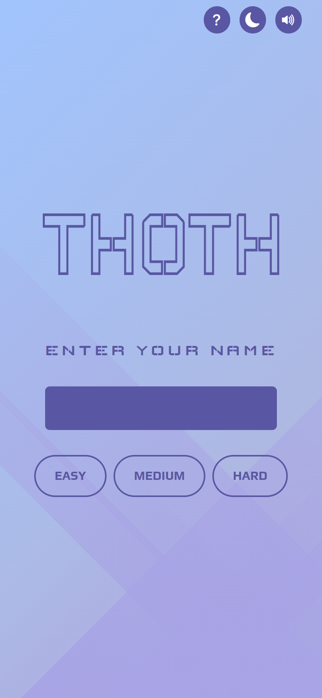
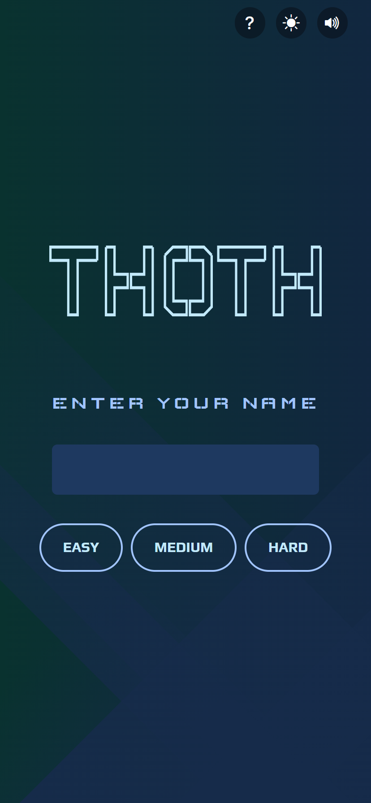
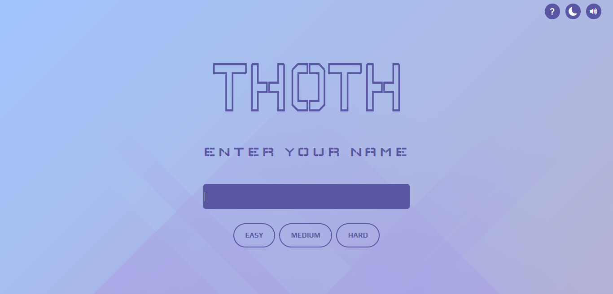
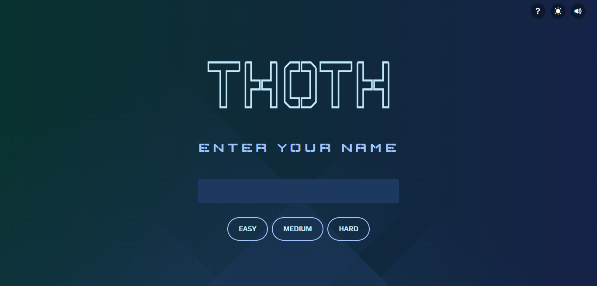

# Thoth - (Computer Science Quiz) Website

Thoth is a responsive website built with Angular and Bootstrap using the Trivia API. It offers an interactive platform for users to test their knowledge in computer science while enjoying cool features such as easy navigation, light/dark mode, music, and responsive text and images.

## Features
Thoth has the following features:

- Easy-navigation buttons for all screen sizes: Users can easily navigate the website and access quiz questions - using the navigation buttons available on all screen sizes.

- Responsive text and images: Thoth is designed to adapt to all screen sizes while maintaining optimal visibility of text and images.

- Light/Dark mode: Users can switch between light and dark mode depending on their preference.

- Music: Thoth offers music to add to the user's experience while answering questions.

- Help section: Users can access a help section to learn how to use the website.

## Used web technologies
Thoth was built using the following web technologies:

- HTML
- SCSS
- [AngularJS](https://angular.io)
- [Bootstrap](https://getbootstrap.com)
- [Trivia API](https://opentdb.com/api_config.php) 

## Testing
The following areas were tested to ensure optimal functionality and user experience:

### Responsiveness and Navigation
- Does the website respond correctly to all screen sizes?
- Does the theme mode change work correctly?
- Does the audio icon play and stop the music as expected?

### Animation
- Does the logo display with a line animation?
- Does each page slide in from the right before loading?

### Placeholder
- Do placeholder elements display before data is loaded from the API to the component?

### Functionality
- Are quiz selections designed to be unclickable after a user has answered a question?
- Does the totalScore increment correctly until the end of the quiz?
- Do the next and previous buttons inside the quiz work as intended?
- Is the previous button designed to be unclickable when it's the first question?
- Does the error alert display when a user fails to enter a value?
- Does the page not found alert error page display when a user enters a non-existing route link?
- Does the page not found error display when a user directly attempts to access a quiz via a route link without   entering their name or difficulty level?
- Does the page not found error display when a user directly attempts to access quiz results via a route link without entering their name or difficulty level?

### Acknowledgement

- Website Background Pattern : [Bgjar](https://bgjar.com/rect-light)
- Thoth Logo Line Drawing : [anime.js](https://animejs.com/documentation/#lineDrawing)
- Angular Router Animation : [Learn Smart Coding](https://www.youtube.com/watch?v=G9zAdwy3Skk)
- Music : [Bensound](Bensound.com/royalty-free-music)

### Deployment
Throughout development of this website, I used **Git** for version control system and constantly commited the changes made to the website. After committing the changes, they were then pushed on the Github where it was later deployed to view the live version using Git Pages. 

[View Live Demo]()

### Screenshots

 